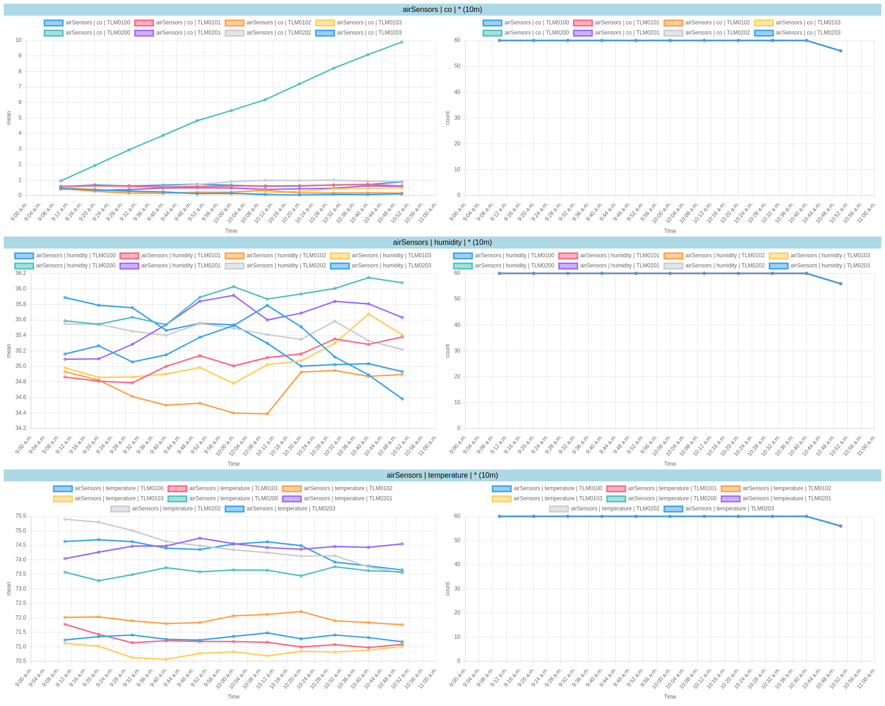

# influxdb-tool

InfluxDB tool.

## Report

```
influxdb-tool report --config-file config.yml --output-file report.html
```

### Sample config file

```
---
org: my_org
bucket: air-sensor
startTime: '2024-12-04T09:00:00+08:00'
endTime: '2024-12-04T11:00:00+08:00'
timezone: Asia/Singapore
timeTooltipFormat: yyyy-MM-dd HH:mm
aggregateWindow: 10m
tagOrder:
  - measurement
  - field
  - sensor_id
aliases:
  measurement: _measurement
  field: _field
tags:
  measurement: airSensors
timeDisplayFormats:
  year: yyyy
  quarter: yyyy QQQ
  month: yyyy-MM
  day: yyyy-MM-dd
  hour: yyyy-MM-dd HH:mm
queries:
  - tags:
      field: co
  - tags:
      field: humidity
  - tags:
      field: temperature
```

### Sample output


